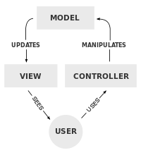
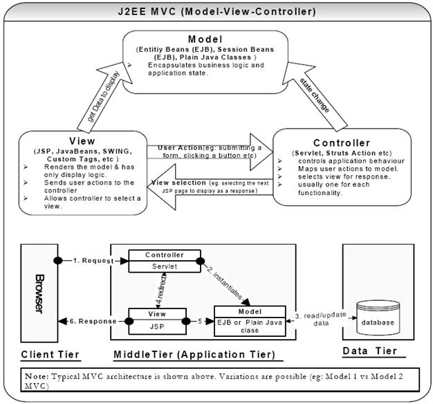
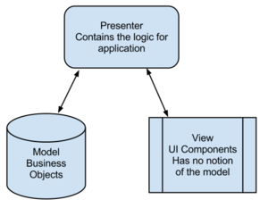

Day 6 - design pattern

Once again when I said that I know something about MVC and then it turned out I did not understand it well as I thought. So after today's interview, I decide to write the principle in my way, not just read and pass it.

### MVC
There is long history of MVC (model-view-controller), at its earlier time, it is described as following:
 

It is noticed that there is no relation between controller and view. It is said the reason is that at that time there is no mouse, all the input is via input device(like keyboard), so there is no need for dealing with different view events.

And as time goes, MVC is changing.  A MVC implement in J2EE technology as showing in following figure.

A user action, such as click a button, was sent to controller, then controller change the state of model according to the type of event. Meanwhile controller refer a view that will respond to user and the view get data needed from model.

All above is what I know about MVC.

### MVP
Model-View-Presenter, short as MVP, is a derivative of MVC. As figure shows:

The model can be considered as interface of data. Any part of data which need data must go through the interface or functions which is defined by programmer who maintains the model part.

The view, as the name implies, is the part where end user interacts. Its main job is to render view and receive events.

The presenter acts as an intermediary. All the business logic need for responding to a user is written inside this layer. Typically the view only has the event handler and the logic to call the appropriate presenter functions. On other hand, presenter also responsible for retrieval data from model and formats it so that the view can render it.

This is just a little summary from myself. More professional description on [JS design pattern][1].

[1]:http://addyosmani.com/resources/essentialjsdesignpatterns/book/#detailmvcmvp